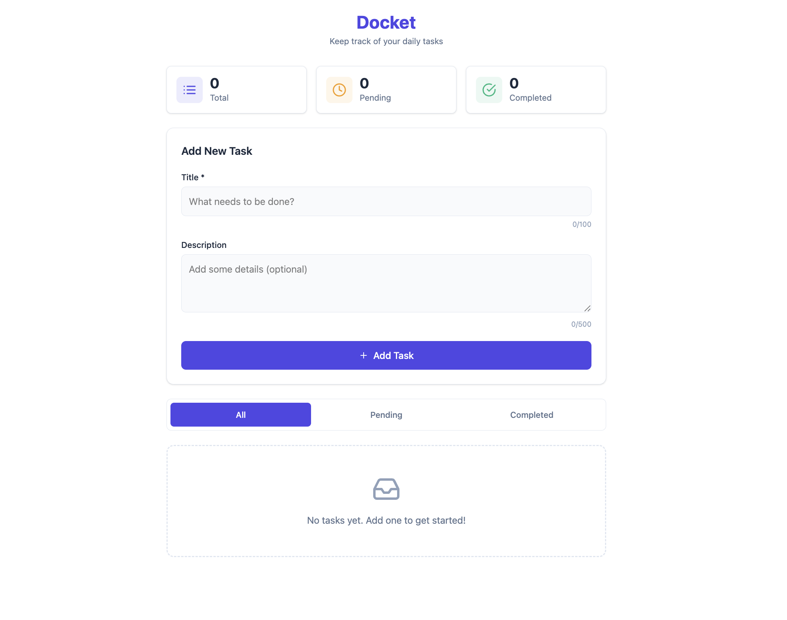
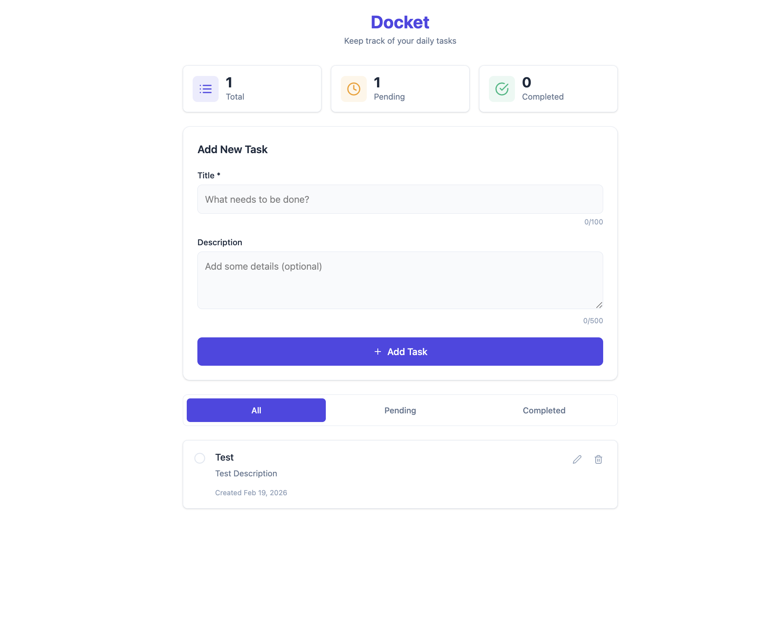
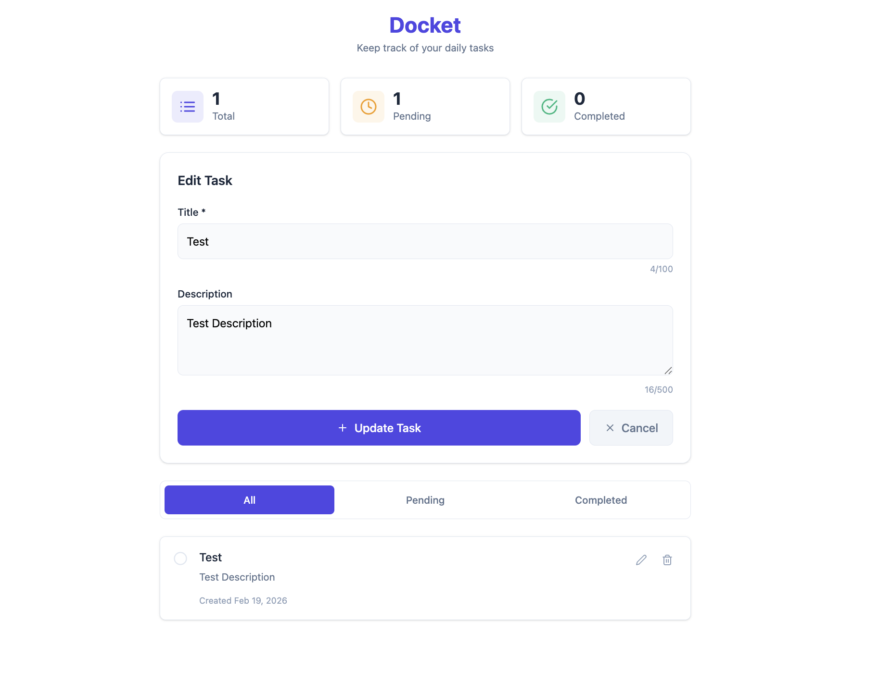

# Docket - Task Management Application

A simple full-stack task management web application built for the Koders Full Stack Internship Assessment.

## Features

- Create tasks with title and description
- View all tasks in a list
- Edit existing task details
- Delete tasks
- Mark tasks as Completed or Pending
- Filter tasks by status (All, Pending, Completed)
- Task statistics dashboard

## Tech Stack

### Frontend
- React 19
- Vite
- Tailwind CSS
- Axios
- React Icons

### Backend
- Node.js
- Express.js
- MongoDB with Mongoose

## Project Structure

```
├── docket-backend/          # Backend API
│   ├── config/              # Database configuration
│   ├── controllers/         # Route controllers
│   ├── middleware/          # Custom middleware
│   ├── models/              # Mongoose models
│   ├── routes/              # API routes
│   └── server.js            # Entry point
│
└── docket-frontend/         # Frontend React app
    ├── src/
    │   ├── components/      # React components
    │   ├── services/        # API service layer
    │   ├── App.jsx          # Main App component
    │   └── main.jsx         # Entry point
    └── index.html
```

## Prerequisites

- Node.js (v18 or higher)
- npm or yarn
- MongoDB (local installation or MongoDB Atlas account)

## Setup Instructions

### 1. Clone the Repository

```bash
git clone <repository-url>
cd Koders
```

### 2. Backend Setup

```bash
# Navigate to backend directory
cd docket-backend

# Install dependencies
npm install

# Create environment file
cp .env.example .env

# Update .env with your MongoDB connection string
# MONGODB_URI=your_mongodb_connection_string
# PORT=3008

# Start the backend server
npm run dev
```

The backend server will run on `http://localhost:3008`

### 3. Frontend Setup

```bash
# Navigate to frontend directory (from project root)
cd docket-frontend

# Install dependencies
npm install

# Start the development server
npm run dev
```

The frontend will run on `http://localhost:5173`

## API Endpoints

| Method | Endpoint | Description |
|--------|----------|-------------|
| GET | `/api/tasks` | Get all tasks |
| GET | `/api/tasks/:id` | Get a single task |
| POST | `/api/tasks` | Create a new task |
| PUT | `/api/tasks/:id` | Update a task |
| PATCH | `/api/tasks/:id/status` | Toggle task status |
| DELETE | `/api/tasks/:id` | Delete a task |
| GET | `/api/health` | Health check endpoint |

## Running the Application

1. Make sure MongoDB is running (locally or use MongoDB Atlas)
2. Start the backend server: `cd docket-backend && npm run dev`
3. Start the frontend server: `cd docket-frontend && npm run dev`
4. Open `http://localhost:5173` in your browser

## Screenshots

### Task Dashboard


### Create Task


### Edit Task


---

**Author:** Deepanshu Sharma
**Assessment:** Full Stack Internship - Koders
